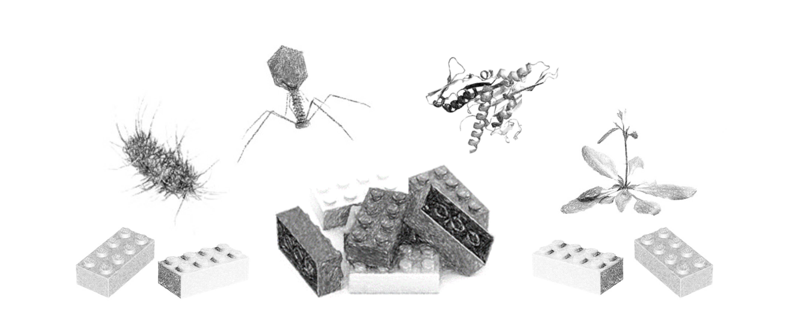

## Intro

Hi, my name is Kirsten Van Huffel and I am a PhD student at the research unit KERMIT (Knowledge-based Systems, Ghent University, 🇧🇪). My main interest is harnessing the power of **machine learning to carry out constructive biology**. In particular, my goal is to leverage generative (energy-based) models for the combinatorial design of new molecules, proteins, genetic circuits or organisms.

 

 
  [GitHub Flavored Markdown](https://guides.github.com/features/mastering-markdown/).

### [📬 Contact](https://kirstvh.github.io/contact)
 
 
