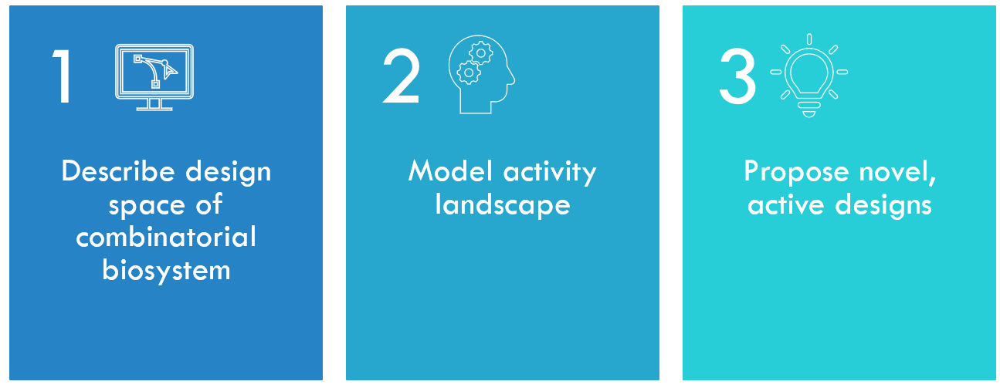

 
[🔙 **Home**](https://kirstvh.github.io)
  
---------------------------

# General overview

Our first goal is to develop tools to describe the design space of combinatorial biosystems.
Second, we aim to model the activity of combinatorial designs by learning from experimental data, learning the underlying pattern of what makes a design active and building an activity landscape over the design space.
Finally, we want to provide concrete recommendations for building novel, active designs.  

  

## 1. The Combinatorial Design Space
### BioCCP.jl

The first main project in my PhD was centered around the experimental design of screening experiments in biotechnology. 
In these experiments, a large number of variants of, for example, proteins, cells or organisms are generated to find an optimal phenotype. 
Here, we make the abstraction of considering each biosystem as a set of modules that is assembled into a design. 

  

For example, you can engineer a protein by varying and recombining existing protein domains. 
In chemical drugs, the type and position of atoms are varied to obtain a highly active configuration.
In plant breeding, one can create various growth phenotypes by performing gene knockouts combinatorially (multiplex CRISPR/Cas).

The large collection of variants we make in the wet lab by randomly varying and recombining modules is called a "library". 

  

There is often a big hurdle here. More specifically, when the number of modules for recombination increase, there is a combinatorial explosion of possible designs!
As a result, one can only screen a subset from all these designs for activity in the lab. This is ofcourse why modelling techniques and machine learning are indispensable: they allow to model the activity of a biosystem based on a (relatively) limited set of examples, and predict the activity of designs that we were not able to analyze in the lab due to constraints in terms of resources and time.

However, an important question is how many variants should still  be present in a library or the "library size" to sufficiently cover the design space. 
In this context, we define "coverage" as the fraction of all available modules (or k-combination of modules) of interest that are present in a library.
Coverage is crucial when we want to build a representative model of design activity based on screening data.

For example, consider a multiplex CRISPR/Cas experiment in plants to find an optimal plant phenotype, e.g., in terms of flowering time, growth and nodule forming. Here, we define a set of target genes and design gRNA sequences that specifically bind them. Random delivery of multiple gRNAs per plant and subsequent CRISPR/Cas-mediated genome editing results in a mutated collection of plant cells with different combinations of gene knockouts.
How many plants should be grown in order to observe each pairwise combination of gene knockouts at least once, taken into account an unequal distribution of gRNA/Cas delivery and the different mutation/knockout efficiencies of gRNAs?

  

We developed the Julia package [BioCCP.jl](https://github.com/kirstvh/BioCCP.jl) to help biotechnologists to determine an adeqate library size for their screening experiments!
A [Pluto notebook](https://kirstvh.github.io/BioCCP_Case_Study_html) with illustrations is available. Consult the accompanying paper [here](https://academic.oup.com/bioinformatics/article-abstract/38/4/1144/6425668?redirectedFrom=fulltext).

---------------------------
 
[🔙 **Home**](https://kirstvh.github.io)
